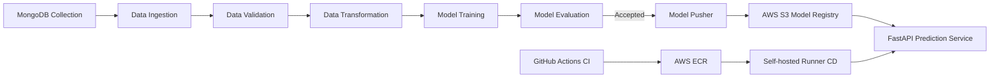

# Vehicle Insurance Prediction: End-to-End MLOps Pipeline

Production-oriented machine learning system for predicting vehicle insurance response, built with:
- `FastAPI` for serving UI + inference
- Modular ML pipeline (`ingestion -> validation -> transformation -> training -> evaluation -> push`)
- `MongoDB` as source data store
- `AWS S3` as model registry/serving source
- `Docker + GitHub Actions + AWS ECR + self-hosted runner` for CI/CD

## 1. Problem Statement

Given customer and policy attributes (age, premium, prior insurance, vehicle age, etc.), predict whether the customer is likely to respond positively to vehicle insurance outreach (`Response = 1`) or not (`Response = 0`).

## 2. High-Level Architecture



## 3. ML Pipeline (Core Focus)

Pipeline orchestration lives in:
- `src/pipeline/training_pipeline.py`

### Stage 1: Data Ingestion
- Source: MongoDB (`Proj1` database, `Proj1-Data` collection)
- Component: `src/components/data_ingestion.py`
- Outputs:
  - Raw feature store CSV
  - Train/Test CSV split (`test_size=0.25`)

### Stage 2: Data Validation
- Component: `src/components/data_validation.py`
- Schema file: `config/schema.yaml`
- Checks:
  - Required columns existence in train/test
  - Validation status + message written to report
- Output:
  - Validation report (JSON content written to `report.yaml` path)

### Stage 3: Data Transformation
- Component: `src/components/data_transformation.py`
- Operations:
  - Gender mapping: `Female -> 0`, `Male -> 1`
  - Drop `_id`
  - One-hot encoding with `pd.get_dummies(drop_first=True)`
  - Column rename:
    - `Vehicle_Age_< 1 Year` -> `Vehicle_Age_lt_1_Year`
    - `Vehicle_Age_> 2 Years` -> `Vehicle_Age_gt_2_Years`
  - Scaling:
    - `StandardScaler` on `num_features` from schema
    - `MinMaxScaler` on `mm_columns` from schema
  - Class balancing using `SMOTEENN`
- Artifacts:
  - Preprocessor object (`preprocessing.pkl`)
  - Transformed arrays (`train.npy`, `test.npy`)

### Stage 4: Model Training
- Component: `src/components/model_trainer.py`
- Model: `RandomForestClassifier`
- Key hyperparameters (from constants):
  - `n_estimators=200`
  - `min_samples_split=7`
  - `min_samples_leaf=6`
  - `max_depth=10`
  - `criterion='entropy'`
  - `random_state=101`
- Metrics computed:
  - F1 score, precision, recall (plus internal accuracy check)
- Acceptance gate:
  - Fails if training accuracy is below expected threshold (`0.6`)
- Output:
  - Wrapped model (`MyModel`) storing both preprocessor + trained model

### Stage 5: Model Evaluation (Champion/Challenger)
- Component: `src/components/model_evaluation.py`
- Current production model is loaded from S3 (if exists)
- New model compared against production model on test data (F1-based decision)
- Accept new model only if its F1 is better than current production

### Stage 6: Model Pusher
- Component: `src/components/model_pusher.py`
- Accepted model pushed to S3 bucket:
  - Bucket: `my-model-mlopsproj2004`
  - Key: `model.pkl`

## 4. Inference & Application Layer

Entry point: `app.py`

### API/Routes
- `GET /` -> HTML form UI (`templates/vehicledata.html`)
- `POST /` -> Predict from form data using S3-hosted model
- `GET /train` -> Trigger complete training pipeline

### Prediction flow
`VehicleData` -> DataFrame -> `VehicleDataClassifier` -> `Proj1Estimator` -> model loaded from S3 -> prediction

## 5. MLOps Design in This Project

- **Pipeline modularity**: each stage isolated in `src/components`
- **Artifacts**: timestamped under `artifact/<timestamp>/...`
- **Schema-driven validation**: centralized in `config/schema.yaml`
- **Model registry pattern**: S3-backed model storage
- **Champion/Challenger gate**: model replaced only if better
- **Reproducibility foundation**: explicit configs/constants + persisted preprocessing object

## 6. CI/CD on AWS (Current Implementation)

Workflow file:
- `.github/workflows/aws.yaml`

### CI Job (`Continuous-Integration`, GitHub-hosted)
- Trigger: push to `main`
- Steps:
  - Checkout code
  - Configure AWS credentials from GitHub Secrets
  - Login to ECR
  - Build Docker image
  - Push image to ECR with tag `latest`

### CD Job (`Continuous-Deployment`, self-hosted)
- Runs after CI
- Steps:
  - Checkout code
  - Configure AWS credentials
  - Login to ECR
  - Stop and remove existing container `vehicleproj`
  - Run latest container on port `5000`
  - Pass runtime secrets as environment variables

## 7. Production-Grade AWS Setup Guide

### Required GitHub Secrets
- `AWS_ACCESS_KEY_ID`
- `AWS_SECRET_ACCESS_KEY`
- `AWS_DEFAULT_REGION`
- `ECR_REPO`
- `MONGODB_URL`

### Required Runtime Environment Variables
- `MONGODB_URL`
- `AWS_ACCESS_KEY_ID`
- `AWS_SECRET_ACCESS_KEY`
- `AWS_DEFAULT_REGION`

### AWS Services Used
- `Amazon ECR` for container registry
- `Amazon S3` for model registry/storage
- EC2/self-hosted runner for deployment target

## 8. Local Development

### Prerequisites
- Python `3.10+`
- Docker (optional for containerized run)
- MongoDB connection string
- AWS credentials with S3 access to model bucket

### Install dependencies
```bash
pip install -r requirements.txt
```

### Run app locally
```bash
python app.py
```
or
```bash
uvicorn app:app --host 0.0.0.0 --port 5000
```

### Trigger training
- Open `http://localhost:5000/train`, or
- Use code:
```python
from src.pipeline.training_pipeline import TrainingPipeline
TrainingPipeline().run_pipeline()
```

## 9. Docker

Build:
```bash
docker build -t vehicle-insurance-app:latest .
```

Run:
```bash
docker run -d --name vehicleproj -p 5000:5000 \
  -e AWS_ACCESS_KEY_ID=... \
  -e AWS_SECRET_ACCESS_KEY=... \
  -e AWS_DEFAULT_REGION=... \
  -e MONGODB_URL=... \
  vehicle-insurance-app:latest
```

## 10. Repository Structure

```text
.
|- app.py
|- config/
|  |- schema.yaml
|  |- model.yaml
|- src/
|  |- components/
|  |- pipeline/
|  |- entity/
|  |- cloud_storage/
|  |- configurations/
|  `- ...
|- templates/
|- static/
|- artifact/
`- .github/workflows/aws.yaml
```

## 11. Production Hardening Checklist (Recommended)

To make this fully production-grade, prioritize:

1. Immutable image tagging:
   - Replace `latest` with commit SHA tags + release tags.
2. Deployment strategy:
   - Use blue/green or rolling deploy instead of stop/remove then run.
3. Health checks:
   - Add `/health` endpoint and container healthcheck.
4. Security:
   - Move from static AWS keys to IAM role/OIDC federation.
   - Store secrets in AWS Secrets Manager/SSM.
5. Model versioning:
   - Store models as versioned keys (`model-registry/<timestamp>/model.pkl`) and keep alias pointer for prod.
6. Observability:
   - Centralized logs, metrics, alerting (CloudWatch + alarms).
7. Testing gates in CI:
   - Add lint, unit tests, data-contract tests before image push.
8. Infra as Code:
   - Manage ECR, IAM, S3 policies, runner infra via Terraform/CloudFormation.

## 12. Notes

- `config/model.yaml` is currently empty and can be used to externalize model parameters.
- Current workflow is functional for continuous delivery but should adopt immutable artifacts + stronger rollback strategy for enterprise production.
